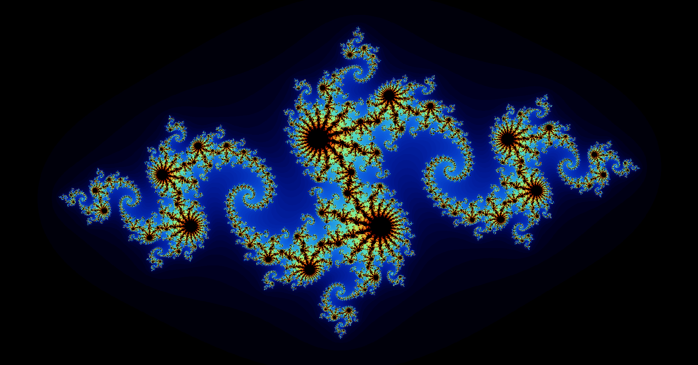

# SFML

this is a project that generates mandelbrot or julias sets based on an input constant 

for mandelbrot, your input should be 0 0 for the constant, else you will be generating a julia set with your input constant 

Examples 

mandelbrot with constant {0,0}

